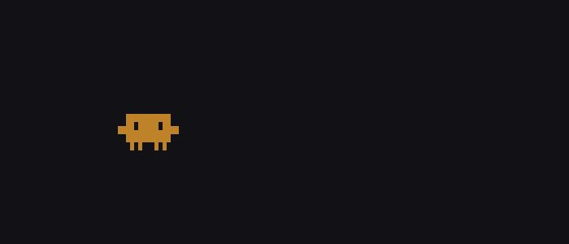

# dancing-clawd



A tiny toy that turns Claude Code hook events into dancing mascots in your
terminal. Each session spawns one Claude that random-walks the screen, tinted
by its current mood (idle / working / tool running / error / needs-you /
done). Subagents spawn their own dancers, and speech bubbles float above the
most recently active session.

## Requirements

- Python 3 (standard library only — no pip install needed)
- Claude Code with a `~/.claude/settings.json`
- A terminal that supports 256-color ANSI and half-block glyphs (`▀`, `▄`)

## Install

```bash
git clone https://github.com/almightychang/dancing-clawd.git
cd dancing-clawd
./install.sh
```

The installer:

1. Copies `hook.py`, `dance.py`, and `mascot_frames.py` into
   `~/.claude/dancing-claude/`.
2. Backs up `~/.claude/settings.json` as `settings.json.bak.<timestamp>`
   before any change.
3. Wires six Claude Code hooks (`UserPromptSubmit`, `PreToolUse`,
   `PostToolUse`, `Notification`, `Stop`, `SubagentStop`) to run `hook.py`.
   Existing hook entries from other tools are preserved.

## Run

Open a spare terminal and start the renderer:

```bash
python3 ~/.claude/dancing-claude/dance.py
```

Then use Claude Code as usual in another terminal. Mascots appear and react
as hook events fire. Stop with `Ctrl-C` — the terminal state is restored on
exit.

## Uninstall

```bash
./install.sh --uninstall
```

Removes only the dancing-clawd hook entries from `settings.json` (other
hooks are untouched) and creates a backup first. The installed files under
`~/.claude/dancing-claude/` are left in place — delete them manually if
you want them gone:

```bash
rm -rf ~/.claude/dancing-claude
```

## How it works

- `hook.py` — invoked by Claude Code on every hook event. Reads the event
  JSON from stdin, updates a per-session entry inside
  `~/.claude/dancing-claude/state.json`, and exits. Multiple concurrent
  sessions are serialized via `flock` on `state.lock`.
- `dance.py` — a standalone renderer. Reads `state.json` on every tick
  (~180 ms), draws one mascot per active session plus one per active
  subagent, and renders a speech bubble above the most recently updated
  session. Sessions inactive for 10 minutes or done for more than 15
  seconds are dropped.
- `mascot_frames.py` — 16×16 pixel sprite frames indexed by mood.
  Rendered with Unicode half-blocks so each sprite occupies 16 columns ×
  8 rows of terminal cells.

## Files

| File | Purpose |
|---|---|
| `install.sh` | Installer / uninstaller |
| `hook.py` | Claude Code hook — writes session state |
| `dance.py` | Terminal renderer |
| `mascot_frames.py` | Sprite frame data |
